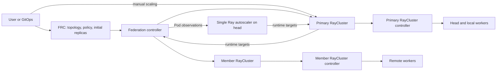

# FederatedRayCluster PoC: design contract and migration

## Scope

`FederatedRayCluster` (FRC) is the only new custom resource. The primary
RayCluster (PRC) and member RayClusters (MRCs) use the existing `RayCluster`
kind. Together they form one Ray runtime with a single head across Kubernetes
clusters. The platform must provide network connectivity. Although the API is
under `ray.io/v1`, this feature is still an Alpha PoC; that path does not imply
API stability or cross-cluster high availability.



The federation controller does not create Ray workload Pods. Ray makes global
autoscaling and drain decisions; each cluster's RayCluster controller handles
local Pod lifecycle. Kubernetes owner references cannot cross clusters, so the
FRC persists remote cleanup responsibility in status. MRCs still own their local
child resources through normal owner references.

## API and field ownership

```yaml
spec:
  primaryCluster:
    rayVersion: "2.56.0"
    enableInTreeAutoscaling: true
    autoscalerOptions:
      version: v2
      idleTimeoutSeconds: 60
    # headGroupSpec and workerGroups
  memberClusters:
    # name, namespace, optional kubeconfigSecretRef, workerGroups
```

The user configures the only autoscaler under FRC `spec.primaryCluster`. The
federation controller projects those fields into the generated PRC `spec`;
MRCs never run an autoscaler. This follows the RayService convention of placing
autoscaler options inside the cluster configuration (`spec.rayClusterConfig`),
while the single primary autoscaler still manages all participating workers.

| Field | Runtime source of truth | Reconciliation |
| --- | --- | --- |
| Topology, templates, member credentials | FRC | Projected by the federation controller |
| Existing group `replicas` and `workersToDelete` | User → PRC without autoscaling; Ray → PRC with autoscaling | Federation controller preserves PRC targets and forwards managed groups to MRCs |
| FRC `workerGroups[].replicas` and `scaleStrategy` | FRC | Initialize new PRC groups only; later FRC edits do not overwrite PRC runtime fields |
| Autoscaling bounds, priority, idle policy | FRC | Projected to PRC for global scheduling; MRC does not prune independently |
| Manual member targets | User → MRC | With no kubeconfig, FRC does not contact the member and global autoscaling is unavailable |
| `RayCluster.workerGroupSpecs[].managedBy` | User or FRC projection | Declares who manages local Pods; does not contain remote credentials |
| Pod lifecycle and local status | Local RayCluster controller | FRC observes and aggregates |

`managedBy` currently accepts two known controller names; it is not a general
plugin interface. Omitting `headGroupSpec` enables workers-only RayClusters,
but changing the Go field from a value to a pointer is a source compatibility
change for SDK consumers. RayJob and RayService continue to require a head.
FRC does not add `externalHead` or `replicaManagement` fields.

## Reconciliation and recovery

1. Admission and reconciliation validate the final projected PRC and MRC
   specs before creating children or recording an immutable revision.
2. Before the first remote write, the controller verifies the member cluster
   UID and persists the destination namespace, credential reference, and
   actual MRC name.
3. A new member that cannot bind does not prevent already bound members from
   receiving confirmed targets. Incomplete global observation still pauses
   new autoscaler decisions.
4. New MRCs prefer `<FRC>-<member>`. A foreign object with that name triggers
   a stable FRC UID suffix; previously recorded names do not change.
5. Deletion attempts cleanup for every member. An unreachable member retains
   its cleanup record. Credential replacement during deletion is allowed only
   after verifying the original cluster UID and persisting the new reference.
6. Delete uses both UID and resourceVersion preconditions and retries after a
   conflict. The recorded child UID prevents deletion of a foreign object.
7. An invalid legacy PRC may be corrected in place only if it owns no workload
   Pods. A running head or local worker template upgrade requires a new FRC.

When a member has already been removed from FRC `spec`, cleanup can use only
the persisted credential reference. Repair that Secret or complete the selected
Orphan policy; redirecting cleanup to a different cluster is unsafe.

## Observation and status

Snapshot protocol v2 includes the primary UID and generation, sampling start
time, adapter source digest, and complete Pod observations. The maximum age is
30 seconds and the size limit is 900 KiB. An over-budget collection publishes
an error instead of truncated capacity.

Before Ray mutates its instance state, every live GCS instance must appear in
the current Pod observation. Missing instances pause that iteration until the
snapshot catches up. After a real deletion, termination can converge once GCS
reports the node dead. Observation is checked again before a drain RPC; a drain
already sent cannot be retracted. This is not an atomic transaction across GCS
and Kubernetes.

| Condition | What it proves | What it does not prove |
| --- | --- | --- |
| `HeadEndpointReady` | Current primary head readiness | Every member can reach the head |
| `MemberControlPlaneReachable` | Managed member API and identity are observable | Ray data-plane health |
| `WorkersReady` | Current Pod capacity meets the target and template | Actor or object continuity |
| `AutoscalerObservationReady` | Last published snapshot was complete and within budget | Autoscaler process health or future freshness |
| `Ready` | Applicable control-plane and capacity observations passed | Cross-cluster HA or a data-plane SLO |

`RayFederation=true` requires `RayClusterStatusConditions=true`; the operator
rejects incompatible feature-gate settings at startup.

## Failure and version boundaries

| Event | Current behavior |
| --- | --- |
| Member API, credential, or snapshot unavailable | Pause new global scaling decisions; healthy members still receive confirmed targets and local operators retain their last target |
| GCS observes a node before the Pod snapshot | Pause the Ray iteration until the observation catches up |
| Operator leader changes | Recover from persisted inventory and optimistic-lock retries |
| Autoscaler startup connection fails | Retry transient Kubernetes failures every five seconds; reject invalid configuration |
| Autoscaler container exits | Automatic sidecar restart is not guaranteed with `restartPolicy: Never`; the PoC uses explicit head replacement |
| Head is lost or replaced | No GCS fault-tolerance path; old actor and object state may be lost |
| Adapter is upgraded | Old processes pause on protocol or source-digest mismatch; ConfigMap changes do not hot-reload Python |
| Long data-plane partition | Running Pods may contain dead Ray nodes; actors may be lost and workers replaced |
| Member deleted under `Delete` policy | Kubernetes removes the MRC and Pods without the normal autoscaler graceful drain guarantee |

The adapter uses private Ray provider and reconciler APIs and is validated only
with **Ray 2.56.0 and autoscaler v2**, Ray commit
`637fd062205393b9e1929996bfe1d49bd3f8469d`. Other patch versions,
custom images, GPU, CNI, and TLS combinations need their own contract tests.
Ray data-plane token authentication is disabled in this PoC; kubeconfig TLS is
not Ray data-plane TLS. Production authentication, least privilege, HA, and
sustained load testing remain separate work.

### Sampling budget measurement

The collector was measured with a fake API store and 100 simulated Pods per
member. Reads are serial and at most 16 members are accepted.

| Members | Delay per remote read | Collection time | Reads | Encoded result |
| --- | --- | --- | --- | --- |
| 1 | 10 ms | 0.037 s | 3 | 40,829 bytes |
| 4 | 10 ms | 0.174 s | 12 | 162,869 bytes |
| 16 | 10 ms | 1.242 s | 48 | 653,429 bytes |
| 16 | 650 ms | 31.98 s | 48 | 235-byte error snapshot; stale capacity rejected |

Removing delay restored a complete snapshot. This measures collection logic,
not 16 live Kubernetes clusters or production API throughput. A separate
serialization test accepted 8,000 minimal fake Pods and rejected 9,000 at the
900 KiB limit; real Pod objects are larger. Reproduce the benchmark with:

```bash
cd ray-operator
go test ./controllers/federation -run '^$' \
  -bench BenchmarkSnapshotCollection -benchtime=1x -count=1
```

## Migrating earlier PoC resources

This is an Alpha API change. Export old FRC objects **before** installing the
new CRD; otherwise removed top-level autoscaler fields may no longer be visible.
For installations already using the nested autoscaler fields, record the PRC
targets and wait for the old controller to finish reconciliation before its
rollout. The new controller preserves existing PRC targets in both modes; FRC
replicas become initial values for new groups.

1. Save the operator Deployment, FRC admission configuration, and all FRC/PRC
   objects. Pause the primary operator and temporarily exclude the migration
   namespace from FRC admission. Existing Ray Pods continue running.
2. Export a migration plan. It moves old top-level autoscaler fields under
   `primaryCluster` and records the current PRC targets. FRC seed values do not
   override existing PRC runtime targets in either mode.
3. Review the plan, update both clusters' CRDs, and apply it. The script checks
   owner UID, FRC UID/resourceVersion, and recorded PRC targets; conflicts stop
   the process rather than forcing an overwrite.
4. Restart the operator and restore admission. Compare head, worker and MRC
   UIDs, PRC targets, and FRC readiness.

```bash
# Run from the repository root after pausing the operator and admission.
python3 ray-operator/test/federation/migrate_api.py export \
  --kubeconfig /path/to/primary.kubeconfig --plan /tmp/frc-migration.json

kubectl --kubeconfig /path/to/primary.kubeconfig apply --server-side \
  -f ray-operator/config/crd/bases/ray.io_federatedrayclusters.yaml
kubectl --kubeconfig /path/to/member.kubeconfig apply --server-side \
  -f ray-operator/config/crd/bases/ray.io_federatedrayclusters.yaml

python3 ray-operator/test/federation/migrate_api.py apply \
  --kubeconfig /path/to/primary.kubeconfig --plan /tmp/frc-migration.json
# Deploy the new operator and restore admission before validating UIDs.
```

The plan contains FRC and PRC data but not kubeconfig Secrets. It is a
one-time migration, not a continuous synchronizer. The earlier API migration was
validated on the local demo; migration of an already running autoscaled FRC
still requires an adapter upgrade plan.

## Suggested review sequence

1. Generic RayCluster support: `managedBy`, workers-only clusters, Go pointer
   compatibility, RayJob/RayService guards, and generated clients.
2. FRC API/controller: projection validation, member lifecycle, credentials,
   status, CRD/Helm/SDK, and migration.
3. Autoscaler adapter: observation protocol, Ray state-machine contract,
   exact version support, and failure tests.
4. Demo: YAML/topology, Dashboard routing, and terminal behavior.

See the [implementation report](federated-raycluster-implementation.md) for
validation and the [historical review](federated-raycluster-review.md) for the
original counterexamples.
